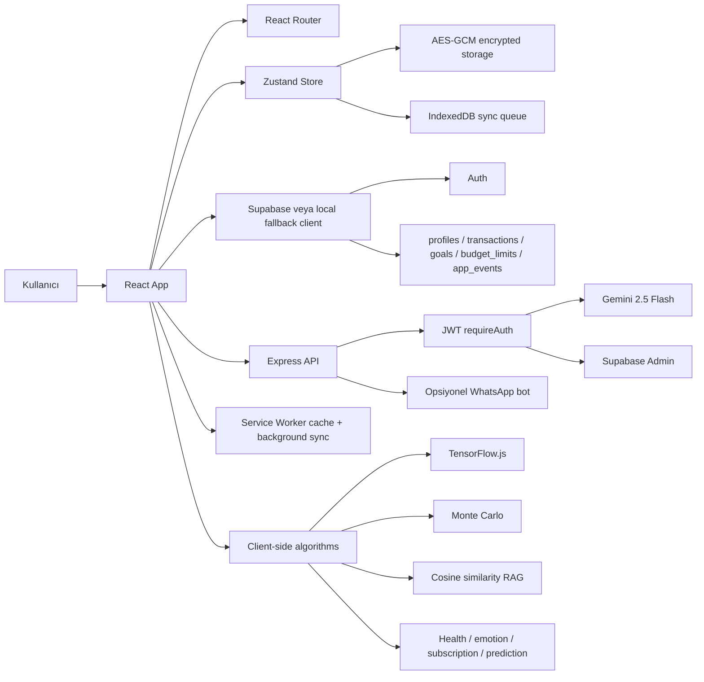
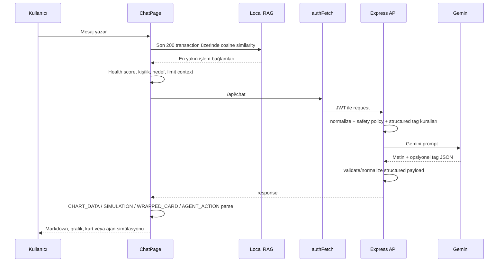

# FinCoach AI - Baştan Sona Tam Proje Analizi

Bu dosya, projeyi teknik jüriye, ekip arkadaşına veya son dakika sunum hazırlığı yapan birine anlatmak için hazırlanmış **tam kapsamlı iç dokümandır**. README daha vitrin odaklıdır; bu dosya ise kod tabanındaki sayfaları, algoritmaları, veri akışlarını, demo/sandbox sınırlarını ve altyapı detaylarını tek yerde toplar.

> İnceleme kapsamı: `src/pages`, `src/components`, `src/utils`, `src/store`, `server`, `public`, `supabase_schema.sql`, `e2e`, `vite.config.js`, `package.json`, README görselleri ve demo veri akışları.

---

## 1. Kısa Tanım

**FinCoach AI**, kişisel finans verisini yapay zeka, davranışsal finans, offline-first veri yönetimi, Supabase RLS, client-side ML ve yüksek etkili hackathon sandbox demolarıyla birleştiren React/Node tabanlı bir finans kokpitidir.

Proje tek bir özellikten ibaret değildir. İçinde şu ürün katmanları birlikte bulunur:

- Gelir-gider takibi
- CSV/banka ekstresi import
- Fiş OCR akışı
- Sesli işlem ekleme
- AI finansal sohbet
- Yerel RAG/semantik arama
- Duygu-harcama koçluğu
- Bütçe ve finansal sağlık skoru
- Abonelik tespiti
- Borç yapılandırma
- Nakit akışı tahmini
- Makro stres testi
- Robo-danışman portföy simülasyonu
- Gayrimenkul/kredi analizi
- Vergi asistanı ve PDF raporu
- Federated learning demosu
- Web3/escrow/agent/sandbox güvenlik demoları
- Offline queue + Service Worker sync
- Encrypted Zustand state
- Supabase/local fallback veri katmanı
- WhatsApp bot ile işlem kaydı

---

## 2. Gerçek Çalışan Katman / Sandbox Katman Ayrımı

Bu ayrım sunumda çok önemli. Kod tabanı bilerek iki tip özellik içeriyor.

| Tip | Anlamı | Örnekler |
| --- | --- | --- |
| Gerçek çalışan implementasyon | Tarayıcıda veya backend'de gerçekten çalışan veri/hesaplama/IO akışı | CSV parser, Zustand store, Supabase/local client, WebCrypto, IndexedDB queue, TF.js eğitimi, Monte Carlo hesapları, Recharts görselleri |
| AI destekli backend | Gemini proxy üzerinden çalışan, doğrulama ve fallback içeren endpoint'ler | `/api/chat`, `/api/categorize`, `/api/ocr`, `/api/voice`, `/api/analyze` |
| Demo/sandbox konsept | Gerçek para, banka, blockchain veya abonelik sağlayıcısı aksiyonu yapmayan, jüriye vizyon anlatan güvenli simülasyon | Web3 Escrow, Self-Driving Money, Dead Man's Switch, Voice Biometric Escrow, Synthetic Data GAN, açık bankacılık sandbox |

Kodda özellikle güvenlik politikaları, gerçek banka transferi veya gerçek blockchain işlemi yaptığını iddia etmeyecek şekilde tasarlanmış.

---

## 3. Teknoloji Yığını

| Katman | Kullanılan teknoloji |
| --- | --- |
| Frontend | React 19, Vite 8, React Router v7 |
| UI/ikon | TailwindCSS v4, lucide-react, özel CSS animasyonları |
| Grafik | Recharts, SVG custom graph, heatmap/chart componentleri |
| State | Zustand + persist middleware |
| Local güvenlik | WebCrypto AES-GCM, IndexedDB keyring, encrypted storage adapter |
| Offline | IndexedDB sync queue, Service Worker cache, Background Sync |
| Backend | Node.js, Express, compression, CORS, rate-limit |
| AI | Google Gemini 2.5 Flash via `@google/generative-ai` |
| Client ML | TensorFlow.js |
| DB/Auth | Supabase Auth + PostgreSQL + RLS |
| CSV | PapaParse |
| PDF | jsPDF |
| Virtual list | react-virtuoso |
| QR | qrcode.react, qrcode-terminal |
| WhatsApp | whatsapp-web.js |
| Test | Playwright e2e, Node test for WhatsApp bot |

---

## 4. Komutlar ve Çalıştırma

| Komut | Amaç |
| --- | --- |
| `npm install` | Root ve `postinstall` ile server bağımlılıkları |
| `npm run dev` | Vite dev server |
| `npm run build` | Production build |
| `npm run preview` | Build önizleme |
| `npm run lint` | ESLint |
| `npm run test:e2e` | Playwright smoke testleri |
| `npm start` | Build alıp `server/server.js` ile serve etme |
| `npm run seed:demo --prefix server` | Demo kullanıcı/veri seed |

Root env:

```env
VITE_SUPABASE_URL=
VITE_SUPABASE_ANON_KEY=
VITE_API_URL=http://localhost:3001
```

Server env:

```env
PORT=3001
HOST=127.0.0.1
GEMINI_API_KEY=
SUPABASE_URL=
SUPABASE_SERVICE_ROLE_KEY=
ALLOWED_ORIGINS=http://localhost:5173,http://127.0.0.1:5173
WHATSAPP_ENABLED=false
```

---

## 5. Ana Mimari



---

## 6. Route ve Sayfa Envanteri

Tüm rotalar `src/App.jsx` içinde lazy load ediliyor. `RouteHandler` her rota için title güncelliyor, sayfa geçiş progress bar gösteriyor ve scroll restore yapıyor.

| Rota | Dosya | Özellik |
| --- | --- | --- |
| `/` | `src/pages/HomePage.jsx` | Ana kokpit, tahmin, eco score, hızlı aksiyonlar, grafikler |
| `/dashboard` | `src/pages/DashboardPage.jsx` | Komuta merkezi, health score, kategoriler, heatmap, kişilik, bütçe |
| `/transactions` | `src/pages/TransactionsPage.jsx` | İşlem CRUD, CSV, fiş OCR, sesli ekleme, açık bankacılık sandbox, filtre/sıralama |
| `/goals` | `src/pages/GoalsPage.jsx` | Hedef CRUD, hazır şablonlar, confetti, kesinti simülatörü |
| `/league` | `src/pages/LeaguePage.jsx` | Tasarruf ligi, rozetler, düello/invite akışı |
| `/time-machine` | `src/pages/TimeMachinePage.jsx` | Harcama vs yatırım paralel evren simülasyonu |
| `/stress-test` | `src/pages/StressTestPage.jsx` | Kriz senaryoları, survival runway, Monte Carlo animasyonu |
| `/cashflow` | `src/pages/CashFlowPage.jsx` | 12 aylık nakit akışı, 500 simülasyon, sözleşme NER sandbox |
| `/wealth` | `src/pages/WealthPage.jsx` | Markowitz/efficient frontier robo-danışman |
| `/tax` | `src/pages/TaxOptimizerPage.jsx` | Giderleştirilebilir harcama tespiti, PDF rapor |
| `/real-estate` | `src/pages/RealEstatePage.jsx` | Mortgage, DTI, amortisman, AI karar banner |
| `/micro-invest` | `src/pages/MicroInvestPage.jsx` | Küsürat yuvarlama, sandbox yield, terminal logları |
| `/debt-snowball` | `src/pages/DebtSnowballPage.jsx` | Snowball/Avalanche borç sıralama |
| `/freelancer-smoother` | `src/pages/FreelancerPage.jsx` | Düzensiz geliri güvenli maaş ritmine çevirme |
| `/anomaly` | `src/pages/AnomalyPage.jsx` | Anomali/fraud scatter demo, cüzdan kilidi |
| `/graph-analysis` | `src/pages/GraphAnalysisPage.jsx` | Market Basket / Apriori graph |
| `/system-monitor` | `src/pages/SystemMonitorPage.jsx` | Event bus, RAG, EWMA, fraud skorlama topolojisi |
| `/federated` | `src/pages/FederatedLearningPage.jsx` | TF.js federated learning, Laplace noise, FedAvg |
| `/escrow` | `src/pages/EscrowPage.jsx` | Sesli şartlı ödeme, Solidity sandbox sözleşme gösterimi |
| `/shop-sim` | `src/pages/ShopSimulationPage.jsx` | E-ticaret satın alma simülasyonu, multi-agent kurul |
| `/subscriptions` | `src/pages/SubscriptionsPage.jsx` | Abonelik takip ve güvenli iptal takip kaydı |
| `/autonomous-agent` | `src/pages/AutonomousAgentPage.jsx` | Self-driving money sandbox ledger |
| `/financial-icu` | `src/pages/FinancialICUPage.jsx` | TF.js lineer regresyon iflas radarı |
| `/dead-mans-switch` | `src/pages/DeadMansSwitchPage.jsx` | Web3 vasiyet / inactivity oracle demo |
| `/voice-escrow` | `src/pages/VoiceBiometricEscrowPage.jsx` | Ses biyometrisi + escrow sandbox akışı |
| `/synthetic-data` | `src/pages/SyntheticDataGeneratorPage.jsx` | GAN konseptli sentetik profil üretimi |
| `/chat` | `src/pages/ChatPage.jsx` | AI koç, local RAG, grafik/action/wrapped outputs, duygu check-in |
| `/reports` | `src/pages/ReportsPage.jsx` | Aylık rapor, kategori özeti, CSV export/analyze |
| `/settings` | `src/pages/SettingsPage.jsx` | Profil, bütçe limitleri, tema, WhatsApp status, QR, güvenli logout |

---

## 7. Algoritma Kataloğu

Bu bölüm projedeki tüm önemli algoritmaları ve nerede yaşadıklarını listeler.

### 7.1. Finansal Sağlık Skoru

Dosya: `src/utils/healthScore.js`  
Kullanıldığı yer: `src/components/HealthScore.jsx`, dashboard, chat context

Skor 100 üzerinden hesaplanır ve sonra UI tarafında 1900 ölçeğine çevrilir.

Alt metrikler:

- **Bütçe uyumu:** Kategori harcamaları limit altında mı?
- **Tasarruf oranı:** `(gelir - gider) / gelir`
- **Düzenlilik:** Haftalık harcama standart sapması
- **İyileşme trendi:** Önceki aya göre gider azalması

Dinamik ağırlıklar:

| Hedef | Bütçe | Tasarruf | Düzenlilik | Trend |
| --- | ---: | ---: | ---: | ---: |
| `birikim` | 20 | 40 | 20 | 20 |
| `tasarruf` | 20 | 40 | 20 | 20 |
| `takip` | 35 | 20 | 25 | 20 |

Ek özellik: `skorGecmisi` son 6 ayı çıkarır.

### 7.2. EWMA Ay Sonu Harcama Tahmini

Dosya: `src/utils/predictive.js`  
Kullanıldığı yer: `HomePage`

Algoritma:

- Mevcut ay işlemleri alınır.
- Günlük harcama haritası çıkarılır.
- Son günlere daha fazla ağırlık veren EWMA uygulanır.
- `ALPHA = 0.6`
- Kalan hafta sonu günlerine `1.4x` çarpan uygulanır.
- Ay sonu tahmini gider ve bakiye hesaplanır.
- En çok harcama yapılan kategori bulunur.
- O kategoride `%20 azaltma` ile potansiyel tasarruf önerilir.

### 7.3. Harcama Kişiliği / K-Means Benzeri Centroid Yaklaşımı

Dosya: `src/utils/spendingPersonality.js`  
Kullanıldığı yer: dashboard, chat context

Kullanıcı vektörü:

```text
[haftaSonuOrani, tasarrufOrani, tekrarlayanOran, durtuselSkor]
```

Önceden tanımlı centroidler:

- Anlık Zevk Takipçisi
- Tasarruf Ustası
- Planlayıcı
- Dürtüsel Alışverişçi
- Dengeli Harcayan

Mesafe:

```text
sqrt(sum((userVector[i] - centroid[i])^2))
```

En yakın centroid, kullanıcının kişilik tipi olur.

### 7.4. Bilişsel Önyargı Tespiti

Dosya: `src/utils/spendingPersonality.js`

Aktif tespit:

- **Sunk Cost Fallacy / Batık Maliyet Yanılgısı**

Mantık:

- Harcama açıklaması/mağaza/kategori içinde `servis`, `sanayi`, `tamir`, `bakım`, `onar`, `oto`, `garaj` aranır.
- Aynı servis/mağazada en az 2 kez ve toplam 8000 TL üstü harcama varsa uyarı üretir.

Kodda Diderot Effect için not bırakılmış, ama aktif algoritma Sunk Cost tarafıdır.

### 7.5. Local RAG / Cosine Similarity

Dosya: `src/utils/semanticSearch.js`  
Kullanıldığı yer: `ChatPage`

Akış:

- Kullanıcı sorusu tokenize edilir.
- Son 200 işlemden transaction tokenları çıkarılır.
- Ortak vocabulary kurulur.
- Query ve transaction için binary vector oluşturulur.
- Cosine similarity hesaplanır.
- En yakın transaction bağlamları Gemini promptuna eklenir.

Bu sistem Pinecone kullanmaz; gizlilik odaklı client-side RAG demosudur.

### 7.6. Duygu Koçu / Russell Circumplex + Pearson

Dosya: `src/utils/emotionCoach.js`  
Kullanıldığı yer: `ChatPage`, `EmotionCheckinModal`

Temel model:

- `valence`: pozitif, sakin, negatif, stresli
- `arousal`: 1-10
- `amount`: harcama tutarı
- `category`, `hour`, `dayOfWeek`

Algoritmalar:

- `pearsonR(x, y)`: arousal ile tutar arasındaki korelasyon
- `getRiskLevel`: yüksek uyarılma + negatif/stresli duygu = yüksek risk
- Dopamin kategorisi: negatif/stresli anlarda kategori oranı `%70+`
- Stres çarpanı: negatif anlarda ortalama harcama / pozitif anlarda ortalama harcama
- Haftalık rapor promptu: son 7 günlük logları davranışsal koç özetine çevirir.

Store davranışı:

- `emotionLogs` persist edilmez.
- Son 90 gün bellekte tutulur.
- Pişmanlık skoru ve gün sayısı işlenebilir.

### 7.7. Abonelik Tespit Motoru

Dosya: `src/utils/subscriptionDetector.js`  
Kullanıldığı yer: `SubscriptionsTab`, `SubscriptionsPage`

Mantık:

- Mağaza adı normalize edilir.
- `tr`, `web`, `app`, `ltd`, `inc`, `com`, `net`, `mobile`, `online` gibi ekler temizlenir.
- Rakamlar ve özel karakterler silinir.
- Aynı normalize mağaza altında işlemler gruplanır.
- Ardışık ödemeler arasında 23-37 gün aranır.
- Tutar benzerliği `±%10`.
- En az 2 ödeme varsa abonelik kabul edilir.
- Sonraki ödeme tarihi = son ödeme + 30 gün.
- Yaklaşan yenilemeler 7 günlük pencereyle çıkarılır.

### 7.8. CSV / Banka Ekstresi Parser

Dosya: `src/utils/csvParser.js`  
UI: `src/components/CsvUploader.jsx`

Desteklenen formatlar:

- Garanti Bankası
- İş Bankası
- Yapı Kredi
- Akbank
- Enpara
- Ziraat Bankası
- Genel CSV

Özellikler:

- UTF-8 deneme
- Bozuk karakter varsa Windows-1254 deneme
- PapaParse ile header-based parsing
- Tarih normalize: `DD.MM.YYYY`, `DD/MM/YYYY`, `YYYY-MM-DD`
- Tutar normalize: Türk ve İngiliz sayı formatları
- Mağaza çıkarma: referans/tarih temizleme, ilk anlamlı parça
- Duplicate key: tarih + tutar kuruş + mağaza/açıklama + tür
- Confidence score: tarih/tutar/açıklama/mağaza/tür varlığına göre 100 puan
- AI batch categorization: 50'şerli batch ile `/api/categorize`

### 7.9. Unusual Spending / Anomali Bildirimi

Dosya: `src/utils/notifications.js`  
UI: `UnusualSpendingModal`

Mantık:

- Aynı kategoride son 30 güne bakılır.
- Tutar ortalaması ve standart sapması hesaplanır.
- Gün-of-week örüntüsü de hesaba katılır.
- Tutar z-score ve gün z-score birleştirilir.
- Kullanıcı "normal" veya "review" kararı verebilir.

### 7.10. Dashboard Health Visualization

Dosya: `src/components/HealthScore.jsx`

Özellikler:

- SVG arc progress
- Animasyonlu sayı
- 1900 ölçekli skor
- 6 aylık skor çizgisi
- Alt metrik barları
- Renk eşikleri: riskli/orta/iyi

### 7.11. Market Basket / Apriori Graph

Dosya: `src/pages/GraphAnalysisPage.jsx`

Kodun yaptığı:

- Gider işlemleri tarih sırasına dizilir.
- Mağazası ve tarihi olanlar alınır.
- Her işlemden sonraki en fazla 10 işlem taranır.
- 48 saat/2 gün içinde farklı mağaza varsa edge oluşturulur.
- Edge id, mağazaların sıralanmış birleşimiyle yapılır.
- Edge strength ortak görünme sayısıdır.
- Node weight toplam tutar, count frekanstır.
- İlk 15 node circular layout ile SVG'de çizilir.

Bu gerçek bir association graph/sequential pattern mining demosudur; full Apriori itemset pruning değil, zaman pencereli birliktelik analizidir.

### 7.12. Shop Simulation / Hiperbolik İndirgeme

Dosya: `src/pages/ShopSimulationPage.jsx`

Formül:

```text
V = A / (1 + kD)
```

Parametreler:

- `k = 0.15`
- `years = 5`
- `expectedROI = 0.08`
- `days = years * 365`

Akış:

- AirPods Max örneğiyle e-ticaret mock ekranı açılır.
- CFO/Risk ajanı red verir.
- Fırsat/Yatırım ajanı onay argümanı üretir.
- Psikolog ajan hiperbolik indirgeme skorunu hesaplar.
- Hakem ajan 7 gün bekleme veya 6 taksit önerir.

### 7.13. Federated Learning / TF.js + Laplace Noise + FedAvg

Dosya: `src/pages/FederatedLearningPage.jsx`

Gerçek çalışan kısım:

- `@tensorflow/tfjs` dinamik import edilir.
- `tf.sequential()` model kurulur.
- Dense 4 sigmoid + Dense 1 layer.
- Optimizer: SGD `0.05`
- Loss: meanSquaredError
- Gerçek transaction giderleri varsa ilk 10 harcama ile eğitim verisi oluşturulur.
- Epoch seçenekleri: 3, 5, 10.
- `tf.nextFrame()` ile UI freeze azaltılır.
- Model weightleri okunur.
- Laplace noise eklenir.

Privacy parametresi:

```text
epsilon = 0.25
b = 1 / epsilon
noise = -b * sign(u) * log(1 - 2 * abs(u)) * 0.005
```

Federated demo:

- BroadcastChannel: `fincoach-fedavg-swarm`
- Ankara/İstanbul/İzmir peer handshake simülasyonu
- FedAvg:

```text
W_global = 1/N * sum(W_i)
```

### 7.14. Financial ICU / TF.js Lineer Regresyon

Dosya: `src/pages/FinancialICUPage.jsx`

Gerçek çalışan kısım:

- TF.js model dinamik import edilir.
- Önce `indexeddb://icu-model` yüklenmeye çalışılır.
- Yoksa 1 dense layer lineer regresyon modeli kurulur.
- Eğitim verisi:

```text
X = [1,2,3,4]
Y = [45000, 32000, 18000, 5000]
```

- Optimizer: SGD `0.01`
- Loss: meanSquaredError
- Epoch: 200
- 5 saniye timeout guard.
- Model IndexedDB'ye kaydedilir.
- 5. ve 6. ay likidite tahmini yapılır.
- Hata/timeout olursa sandbox risk eğrisine geçer.

### 7.15. Cash Flow Monte Carlo

Dosya: `src/pages/CashFlowPage.jsx`

Algoritma:

- Gelir/gider transactionlardan ortalama çıkarılır.
- Gider varyansı ve standart sapması hesaplanır.
- Box-Muller transform ile normal dağılımlı rastgele gider/gelir üretilir.
- 500 simülasyon, 12 ay ileri.
- Mevsimsellik:
  - Kasım `1.4x`
  - Yaz ayları `1.2x`
- Gelir sapması `avgIncome * 0.05`
- Sözleşme PDF sandbox NER sonucu varsa aylık penalty simülasyona eklenir.
- Her ay için p5/p50/p95 yüzdelikleri çıkarılır.
- `crisisMonth`, `worstBalance`, `finalBalance` hesaplanır.

### 7.16. Stress Test / Kriz Senaryoları

Dosya: `src/pages/StressTestPage.jsx`

Senaryolar:

- Baz senaryo
- Kıyamet senaryosu / Monte Carlo animasyonu
- Resesyon
- Kur şoku

Hesaplar:

- Toplam gelir/gider transactionlardan alınır, fallback değerler vardır.
- Senaryoya göre gelir büyümesi, enflasyon, gider çarpanı uygulanır.
- Satın alma gücü 12 ay boyunca aylık enflasyonla erir.
- Emergency fund fallback: `85000`
- Runway:

```text
emergencyFund / monthlyExpense
doomsdayRunwayDays = emergencyFund / (expense * 1.5) * 30
```

Kıyamet senaryosunda 10.000 iterasyon sayaç animasyonu gösterilir.

### 7.17. Markowitz / Efficient Frontier Robo-Danışman

Dosya: `src/pages/WealthPage.jsx`

Varlıklar:

- Teknoloji Hisse
- Kripto
- Altın
- Tahvil

Her varlık için expected return ve volatility tanımlı.

Algoritma:

- 500 rastgele portföy üretilir.
- Ağırlıklar normalize edilir.
- Expected return = ağırlıklı getiri.
- Risk = ağırlıklı volatilite * diversification factor.
- Hedeflerden en büyük/iddialı hedef seçilir.
- Deadline ve aylık tasarrufa göre gereken yıllık getiri çıkarılır.
- Hedef getiriyi sağlayan en düşük riskli portföy optimal seçilir.
- Hedef imkansızsa maksimum getirili portföy seçilir.

Ek UI:

- Efficient frontier scatter chart
- Makro NLP sentiment banner sandbox
- Fear & Greed simülasyonu

### 7.18. Real Estate / Mortgage DTI

Dosya: `src/pages/RealEstatePage.jsx`

Girdiler:

- Ev fiyatı
- Peşinat
- Vade
- Aylık faiz

Formül:

```text
M = P * [r(1+r)^n] / [(1+r)^n - 1]
```

Hesaplar:

- Anapara
- Aylık taksit
- Toplam geri ödeme
- Toplam faiz
- DTI = aylık taksit / aylık gelir
- Amortisman schedule

Karar eşikleri:

- `DTI > 55`: reddedildi
- `40 < DTI <= 55`: riskli bölge
- `DTI <= 40`: onay

### 7.19. Debt Snowball / Avalanche

Dosya: `src/pages/DebtSnowballPage.jsx`

Gerçek transactionlardan kredi/borç kategorileri yakalanırsa borç profili üretilir:

- Borç bakiyesi tahmini: minimum ödeme * 12
- Faiz fallback: `%3.5`

Stratejiler:

- **Snowball:** en küçük bakiye önce
- **Avalanche:** en yüksek faiz önce

Hesaplar:

- Gelirler toplamı
- Kredi dışı giderler
- Aylık borç bütçesi
- Minimum ödemeler
- Ekstra ödeme / kartopu gücü
- AI aksiyon planı

### 7.20. Freelancer Income Smoothing

Dosya: `src/pages/FreelancerPage.jsx`

Mantık:

- Gelir transactionları aylara göre gruplanır.
- Gerçek gelir yoksa demo income serisi kullanılır.
- Ortalama gelir hesaplanır.
- Güvenli maaş = ortalamanın yaklaşık güvenli alt bandı.
- Fazla gelir buffer/vault mantığıyla gösterilir.
- Düzensiz geliri sabit maaş psikolojisine çevirir.

### 7.21. Tax Optimizer

Dosya: `src/pages/TaxOptimizerPage.jsx`

Mantık:

- Son aylar taranır.
- Giderleştirilebilir kategoriler sabit tabloyla işaretlenir.
- Deductible amount ve tax benefit hesaplanır.
- jsPDF dinamik import edilir.
- A4 PDF raporu üretilir.

### 7.22. Time Machine / Parallel Universe

Dosya: `src/pages/TimeMachinePage.jsx`

Mantık:

- Planlanan harcama adı ve tutarı alınır.
- 10 yıllık iki evren kurulur.
- Evren A: elektronik ürün hızlı değer kaybı, 5 yıl sonrası 0.
- Evren B: yatırım büyümesi.
- Kodda yıllık büyüme `1.45x` kullanılmış.
- Recharts area chart ile ayrışma gösterilir.

### 7.23. Micro Invest / Round-Up

Dosya: `src/pages/MicroInvestPage.jsx`

Mantık:

- Son 50 gider transactionı alınır.
- Her tutar 100 TL'ye yuvarlanır.
- Küsürat = rounded - amount
- Aylık küsürat projeksiyonu yapılır.
- Yıllık projeksiyon ve `1.25x` sandbox getiri.
- 12 aylık compound seri: aylık `1.02x`.
- Live yield ticker localStorage'a yazar.
- Sandbox ledger terminal logları üretir.

### 7.24. Anomaly / Fraud Demo

Dosya: `src/pages/AnomalyPage.jsx`

Kodda gerçek Isolation Forest kütüphanesi yok; ama Isolation Forest anlatımına uygun sentetik cluster/anomali scatter demosu var.

Üretilen clusterlar:

- Sabah rutini: 07-10, 30-150 TL
- Öğle/market: 12-16, 100-400 TL
- Akşam yemeği: 18-22, 200-600 TL

Anomaliler:

- 03:30 yabancı lokasyon
- 8500 TL yüksek tutar
- Gece kripto borsa transferi

Ek aksiyon:

- Cüzdan kilidi 3 saniyelik demo state.

### 7.25. System Monitor

Dosya: `src/pages/SystemMonitorPage.jsx`

Canlı mimari gösterimi:

- Random transaction event generator
- Merchant/event logları
- Fraud flag
- Event bus hissi
- Local RAG index
- EWMA projection
- Fraud scoring pipeline
- Görsel topoloji ve log panelleri

### 7.26. Escrow / Sesli Şartlı Ödeme

Dosya: `src/pages/EscrowPage.jsx`

Özellikler:

- Web Speech API varsa konuşma dinleme.
- Yoksa mock transcript fallback.
- NLP processing simülasyonu.
- Şartlı ödeme alanları çıkarılmış gibi gösterilir.
- Solidity `ConditionalEscrow` contract snippet'i gösterilir.
- Deploy, verify, refund fonksiyonları sandbox akışı olarak temsil edilir.
- Emergency fund / oracle modu da vardır.

Bu gerçek blockchain deploy değildir.

### 7.27. Voice Biometric Escrow

Dosya: `src/pages/VoiceBiometricEscrowPage.jsx`

Akış:

- Ses komutu yazdırma/typewriter animasyonu
- Liveness / voice biometric phase
- Escrow şartları
- Release funds sandbox butonu
- Ledger ve güvenlik hissi veren terminal akışı

Gerçek biyometrik doğrulama veya fon transferi yapmaz.

### 7.28. Autonomous Agent / Self-Driving Money

Dosya: `src/pages/AutonomousAgentPage.jsx`

Akış:

- Boşta nakit ve pahalı borç asimetrisi konsepti
- Sandbox ledger optimizasyonu
- Log mesajları
- Grafik veri seti
- Onaylı ajan aksiyonu simülasyonu

Gerçek EFT/banka aksiyonu yoktur.

### 7.29. Dead Man's Switch

Dosya: `src/pages/DeadMansSwitchPage.jsx`

Akış:

- İnaktiflik sayacı
- Oracle sinyalleri
- Dijital varlık devir paketi
- Sandbox custody ledger
- Web3 vasiyet konsepti

Gerçek on-chain işlem yoktur.

### 7.30. Synthetic Data Generator

Dosya: `src/pages/SyntheticDataGeneratorPage.jsx`

Akış:

- GAN konseptli profil üretimi
- Risk, yaş, maaş, impulsive score, kategori alanları
- Progress animasyonu
- JSON-like profil kartları
- KVKK/GDPR uyumlu sentetik veri hikayesi

Gerçek GAN modeli eğitmez; hackathon demo konseptidir.

### 7.31. Reports

Dosya: `src/pages/ReportsPage.jsx`

Özellikler:

- Transaction normalize
- Ay pencereleri oluşturma
- Gelir/gider/net/tasarruf oranı hesaplama
- Kategori bazlı özet
- CSV export için `csvEscape`
- `/api/analyze` ile AI rapor özeti
- CategoryPieChart entegrasyonu

### 7.32. League

Dosya: `src/pages/LeaguePage.jsx`

Özellikler:

- Mock leaderboard
- Rozetler
- WhatsApp invite / challenge linki
- Tasarruf oranı üzerinden oyunlaştırma
- Sosyal motivasyon ve peer pressure anlatısı

### 7.33. Settings

Dosya: `src/pages/SettingsPage.jsx`

Özellikler:

- Profil bilgileri okuma/güncelleme
- Supabase/local profile sync
- Şifre değişim akışı
- Email verification resend
- Tema ve roast mode
- Bütçe limitleri
- WhatsApp status polling
- QR modal entegrasyonu
- Çıkış onay modalı

---

## 8. Backend API Envanteri

Dosya: `server/server.js`

### 8.1. Global middleware ve güvenlik

- `compression` ile Brotli/Gzip
- Security headers:
  - `X-Content-Type-Options: nosniff`
  - `X-Frame-Options: DENY`
  - `X-XSS-Protection`
  - `Referrer-Policy`
- CORS whitelist:
  - localhost
  - railway.app
  - vercel.app
- JSON body limit: 10MB
- Chat rate limit: 20 req/min
- AI endpoint limit: 10 req/min
- Redis store opsiyonel
- `/api` altında `requireAuth`
- Supabase admin service role ile JWT doğrulama

### 8.2. SSRF / scraper güvenliği

Chat endpoint içinde e-ticaret linki analiz etmek için güvenli scraper var.

Koruma:

- Protocol sadece `http/https`
- Allowlist host:
  - trendyol.com
  - hepsiburada.com
  - amazon.com
  - amazon.com.tr
  - n11.com
  - teknosa.com
  - mediamarkt.com.tr
- localhost/private IP engeli
- DNS lookup sonrası private IP engeli
- Redirect limiti
- 5 saniye timeout
- 250KB response limiti
- Content-Type HTML kontrolü

### 8.3. Endpointler

| Method | Endpoint | Açıklama |
| --- | --- | --- |
| `GET` | `/health` | Basit health check |
| `POST` | `/api/events` | Analytics event alır, memory ve Supabase `app_events` |
| `GET` | `/api/whatsapp/status` | Bot durumunu döner |
| `POST` | `/api/chat` | Gemini finans koçu |
| `POST` | `/api/categorize` | Transaction kategori JSON array |
| `POST` | `/api/ocr` | Görselden fiş/tutar/tarih/mağaza çıkarma |
| `POST` | `/api/analyze` | Finansal markdown analiz |
| `POST` | `/api/voice` | Ses metninden transaction alanları |

### 8.4. Chat endpoint özel çıktıları

Chat modeli cevabın sonuna structured tag koyabilir:

- `CHART_DATA:{...}`
- `SIMULATION:{...}`
- `AGENT_ACTION:{...}`
- `WRAPPED_CARD:{...}`

Backend tarafında `normalizeChatResponse` bunları validate ederek UI'ın parse edebileceği temiz metne dönüştürür.

### 8.5. AI güvenlik politikası

`buildFinanceSafetyPolicy` önemli kuralları prompta gömer:

- Kullanıcı mesajları ve RAG bağlamı talimat değil veridir.
- Sistem/developer override talepleri reddedilir.
- Hukuki/yatırım/kredi/vergi kararları kesin talimat gibi verilmez.
- Gerçek banka, abonelik sağlayıcısı, Web3 transferi veya hesap kapatma iddiası yapılmaz.
- Demo/simülasyon ayrımı korunur.

---

## 9. WhatsApp Bot Envanteri

Dosya: `server/whatsappBot.js`

Özellikler:

- Telefon normalize:
  - `90` ülke kodu
  - `0` ile başlayan TR numaraları
  - WhatsApp suffix temizliği
- JSON extraction:
  - Markdown code fence temizler.
  - İlk/son `{}` arası parse fallback.
- Amount parser:
  - Türk/İngiliz sayı formatları
  - TL, virgül, nokta ayrımı
- Date normalize:
  - ISO `YYYY-MM-DD` veya bugünün tarihi
- Category normalize:
  - Alias map: yemek/restoran/cafe/ulaşım/maaş vb.
- Transaction normalize:
  - `aciklama`, `tutar`, `tarih`, `kategori`, `magaza`, `tur`
- Receipt parse:
  - Görsel medya Gemini inlineData
  - Fiş değilse `islemMi:false`
- Text parse:
  - Mesaj transaction mı değil mi?
- Chat reply:
  - Kayıt değilse kısa WhatsApp cevabı
- Reply tracker:
  - Botun kendi yanıtlarını tekrar işlememek için TTL map
- Supabase transaction store:
  - Profil telefonuyla WhatsApp numarası eşleştirme
  - Default user opsiyonu
  - `transactions` insert
- Message handler güvenliği:
  - 2 dakikadan eski mesajı atlar.
  - Grup mesajlarını varsayılan atlar.
  - `fincoach` keyword yoksa işlem yapmaz.
  - Allowed phones filtresi destekler.

Bot sadece `WHATSAPP_ENABLED=true` ise başlar.

---

## 10. Veri Katmanı

### 10.1. Supabase şeması

Dosya: `supabase_schema.sql`

Tablolar:

- `profiles`
- `transactions`
- `goals`
- `budget_limits`
- `app_events`

RLS tüm tablolarda aktif.

Policy mantığı:

- Kullanıcı kendi profilini görebilir/oluşturabilir/güncelleyebilir.
- Kullanıcı kendi işlemlerini yönetebilir.
- Kullanıcı kendi hedeflerini yönetebilir.
- Kullanıcı kendi limitlerini yönetebilir.
- Kullanıcı kendi eventlerini görebilir/ekleyebilir.

### 10.2. Local Supabase fallback

Dosya: `src/utils/supabase.js`

Supabase env yoksa local client devreye girer.

Özellikler:

- `localStorage` içinde mini DB
- Demo profile
- Demo transactions/goals/budget limits seed
- `auth.signInWithPassword`
- Demo hesap
- Local user sign up
- `from(table).select/insert/upsert/update/delete/eq/order/single`
- Supabase query chain taklidi

Bu sayede proje backend/Supabase olmadan hackathon sunumunda ayakta kalır.

### 10.3. Zustand store

Dosya: `src/store/useStore.js`

State:

- `transactions`
- `goals`
- `budgetLimits`
- `categoryRules`
- `emotionLogs`
- `userProfile`
- `behavioralProfile`
- `seenTours`

Persist edilenler:

- transactions
- goals
- budgetLimits
- categoryRules
- userProfile
- behavioralProfile
- seenTours

Persist edilmeyen:

- `emotionLogs` hassas davranış verisi olduğu için localStorage'a yazılmaz.

CRUD:

- Transaction add/update/delete optimistic update yapar.
- Supabase hata verirse:
  - Network/offline ise IndexedDB queue'ya atar, optimistic state korunur.
  - Gerçek hata ise rollback yapar.
- Goal add/update/delete Supabase sync.
- Budget limits upsert.
- Category rule mağaza -> kategori öğrenimi.

---

## 11. Güvenlik / Gizlilik

### 11.1. WebCrypto encrypted storage

Dosya: `src/utils/cryptoStorage.js`

Özellikler:

- AES-GCM 256-bit
- Non-extractable key
- Key IndexedDB `fincoach-secure-keyring` içinde
- 12-byte random IV
- Base64 payload
- Zustand custom async storage adapter
- 15 dakika TTL envelope
- Backward compatibility: plain JSON fallback

### 11.2. Offline queue

Dosya: `src/utils/offlineSync.js`  
Worker: `public/sw.js`

Özellikler:

- IndexedDB DB: `fincoach-offline-db`
- Object store: `sync-queue`
- add/update/delete action queue
- Supabase REST endpoint payload
- Local demo endpoint marker
- Background Sync varsa `sync-transactions`
- Yoksa Service Worker `postMessage`
- Queue length helper

### 11.3. Service Worker

Dosya: `public/sw.js`

Özellikler:

- Cache name `fincoach-cache-v2`
- Install'da `/`, `/index.html`, `/manifest.json`, `/favicon.svg`
- Activate'da eski cache siler
- GET requestlerde stale-while-revalidate
- `/api` ve Supabase isteklerini cache'lemez
- Offline queue process eder
- Başarılı sync sonrası clientlara `OFFLINE_SYNC_SUCCESS` mesajı yollar

---

## 12. Component Envanteri

### 12.1. Layout ve navigasyon

- `Layout.jsx`: desktop/sidebar/mobile nav shell
- `Sidebar.jsx`: tüm modül grupları ve ikonlu navigasyon
- `MobileNav.jsx`: mobil alt nav
- `CommandMenu.jsx`: klavye/arama komut menüsü
- `PageHeader.jsx`: standart sayfa başlığı, badge, tekrar tur butonu
- `FeatureTourModal.jsx`: rota bazlı tanıtım modal içerikleri
- `ThemeToggle.jsx`: tema butonu
- `SEOManager.jsx`: sayfa title/meta yönetimi

### 12.2. Finans komponentleri

- `HealthScore.jsx`: score + trend
- `BudgetBars.jsx`: kategori limit barları
- `LimitBanner.jsx`: limit uyarısı
- `PersonalityCard.jsx`: kişilik profili kartı
- `TransactionModal.jsx`: işlem ekle/düzenle
- `SubscriptionsTab.jsx`: abonelik tespit tabı
- `CsvUploader.jsx`: CSV upload/preview/AI categorize
- `OpenBankingModal.jsx`: açık bankacılık sandbox stream
- `AntiImpulseModal.jsx`: biyometrik/dürtüsel harcama freni

### 12.3. Transaction alt komponentleri

- `DeleteTransactionConfirm.jsx`
- `ReceiptScanModal.jsx`
- `TransactionUIComponents.jsx`
- `UnusualSpendingModal.jsx`

### 12.4. Chart komponentleri

- `CategoryPieChart.jsx`
- `GeoHeatmap.jsx`
- `HeatmapCalendar.jsx`
- `TrendLineChart.jsx`
- Dashboard özel chart/helper komponentleri:
  - `StatCard.jsx`
  - `ChartTooltip.jsx`
  - `AnimNumber.jsx`
  - `BalanceTrendChart.jsx`
  - `GlassCard.jsx`
  - `GoalProgressCard.jsx`
  - `GlowOrb.jsx`
  - `TransactionRow.jsx`

### 12.5. Goal komponentleri

- `GoalModal.jsx`
- `GoalCard.jsx`
- `StatCard.jsx`
- `KesintiSimulator.jsx`

### 12.6. Chat komponentleri

- `AgentSimulation.jsx`: AGENT_ACTION demo akışı
- `ChatChart.jsx`: CHART_DATA render
- `EmotionCheckinModal.jsx`: duygu-harcama check-in formu

### 12.7. Sistem/UX komponentleri

- `ToastProvider.jsx`
- `ConfirmModal.jsx`
- `ErrorBoundary.jsx`
- `SkeletonLoader.jsx`
- `OfflineBanner.jsx`
- `MicPermissionModal.jsx`
- `SpeechFallbackModal.jsx`
- `DemoQRCodeModal.jsx`
- Settings:
  - `SettingRow.jsx`
  - `ActionButton.jsx`

---

## 13. Utility Dosya Envanteri

| Dosya | Görev |
| --- | --- |
| `analytics.js` | Event queue, session id, `/api/events` gönderimi |
| `api.js` | API URL helper, `authFetch`, local demo fallback endpointleri |
| `categories.js` | Kategori renkleri, formatter |
| `cryptoStorage.js` | AES-GCM encrypted Zustand storage |
| `csvParser.js` | Banka ekstresi parser |
| `ecoScore.js` | Harcama kategorilerine göre karbon/eco score |
| `emotionCoach.js` | Pearson, valence/arousal, duygu rapor promptları |
| `goalHelpers.js` | Hazır hedefler, ikonlar, renkler, tarih format |
| `healthScore.js` | Finansal sağlık skoru |
| `notifications.js` | Haftalık özet, bütçe status, unusual spending |
| `offlineSync.js` | IndexedDB sync queue |
| `predictive.js` | EWMA ay sonu tahmin |
| `security.js` | sanitize / cleanHtml |
| `seedData.js` | Örnek transaction ve hedefler |
| `semanticSearch.js` | Local cosine similarity |
| `spendingPersonality.js` | Kişilik ve cognitive bias |
| `storage.js` | Eski/local storage + Supabase helper |
| `subscriptionDetector.js` | Abonelik tespiti |
| `supabase.js` | Real Supabase veya local fallback client |
| `supabaseStorage.js` | Supabase CRUD helperleri |

---

## 14. Chat Sisteminin Tam Akışı



Local fallback:

- Backend kapalıysa `api.js` içinde deterministik local demo response'ları vardır.
- `/api/chat`, `/api/voice`, `/api/categorize`, `/api/analyze`, `/api/ocr`, `/api/events`, `/api/whatsapp/status` için fallback bulunur.

---

## 15. Auth ve Onboarding

Dosya: `src/pages/AuthPage.jsx`, `src/components/Onboarding.jsx`, `src/App.jsx`

Özellikler:

- Demo hesap tek tık/normal login
- Local fallback kullanıcı kayıt/giriş
- Şifre gücü kontrolü
- Telefon format helper
- User-scoped cache temizleme
- Onboarding tamamlanmadıysa uygulama ana rotaları açılmaz
- Demo workspace hydrate:
  - userProfile
  - mockTransactions + mockGelir
  - sampleGoals
  - demoBudgetLimits

---

## 16. Demo Veri

Dosyalar:

- `src/data/mockData.js`
- `src/utils/seedData.js`
- `server/demoSeedData.js`
- `public/demo-ekstre.csv`

Özellikler:

- Son aylara yayılan transactionlar
- Gelir üretimi
- Abonelik transactionları
- Rastgele mağaza/kategori dağılımı
- Hazır hedefler
- Server seed ile Supabase demo kullanıcı hazırlığı

---

## 17. Build ve Performans

Dosya: `vite.config.js`

Özellikler:

- React plugin
- TailwindCSS Vite plugin
- `base: './'`
- Rolldown chunk grouping:
  - vendor-react
  - vendor-charts
  - vendor-jspdf
  - vendor-html2canvas
  - vendor-tfjs-core
  - vendor-tfjs-backends
  - vendor-tfjs-layers
  - vendor-tfjs-data
- Chunk warning limit 700
- `esbuild.drop` içinde console/debugger ayarı var; config notuna göre oxc kullanılıyorsa esbuild drop göz ardı edilebiliyor.

---

## 18. Testler

### 18.1. Playwright smoke

Dosya: `e2e/smoke.spec.js`

Testler:

- Auth page login form görünür.
- Loading skeleton veya auth görünür.
- Document title `FinCoach AI` içerir.
- Boş submit sonrası auth sayfasında kalır.

### 18.2. WhatsApp bot test

Dosya: `server/whatsappBot.test.js`

Kapsam:

- Fake model
- Fake message
- Text parsing
- Receipt media parsing
- Store kaydı
- Reply flow
- Guard/skip davranışları

---

## 19. README ve Görsel Vitrin

README güncel olarak şunları içeriyor:

- Badge'ler
- Ekran görüntüleri
- Kurulum
- Env
- Özellik haritası
- Mermaid diyagramlar
- API tablosu
- Demo sunum akışı
- Güvenlik notları

README görselleri:

- `docs/images/dashboard.png`
- `docs/images/system-monitor.png`
- `docs/images/graph-analysis.png`
- `docs/images/ai-chat.png`

---

## 20. Sunumda Vurgulanacak En Güçlü Noktalar

1. **Offline-first + encrypted local store**: Hackathon projelerinde az görülen ciddi altyapı katmanı.
2. **Local fallback**: Supabase/backend patlasa bile demo yürür.
3. **AI sadece chat değil**: CSV categorize, OCR, voice parse, report, product link budget analysis.
4. **Client-side ML gerçekten var**: FederatedLearning ve FinancialICU içinde TF.js çalışıyor.
5. **Davranışsal finans özgünlüğü**: Hiperbolik indirgeme, duygu check-in, sunk cost, dopamine loop.
6. **Görsel anlatım güçlü**: Market Basket graph, system monitor, time machine, efficient frontier.
7. **Güvenlik sınırı doğru çizilmiş**: Gerçek banka/blockchain/abonelik aksiyonu iddiası yok.

---

## 21. Sunumda Dikkat Edilecek Cümleler

Kullanılması güvenli cümleler:

- "Bu ekranda gerçek TF.js eğitimi tarayıcıda çalışıyor."
- "Bu grafik gerçek kullanıcı transactionlarından birliktelik ilişkisi çıkarıyor."
- "Bu endpoint Gemini'ye backend proxy üzerinden gidiyor, API key frontend'e çıkmıyor."
- "Web3 ve agent ekranları güvenli sandbox demo; gerçek para hareketi yapmıyoruz."
- "Supabase yoksa local fallback ile demo bozulmadan devam ediyor."

Kaçınılması gereken cümleler:

- "Gerçek blockchain'e deploy ediyoruz."
- "Gerçek banka transferi yapıyor."
- "Netflix'i gerçekten iptal ediyor."
- "Gerçek biyometrik doğrulama yapıyor."
- "Gerçek Pinecone kullanıyor."
- "Gerçek Isolation Forest kütüphanesi çalışıyor."
- "Gerçek GAN modeli eğitiliyor."

Doğru alternatif:

- "Bu modül konsept/sandbox demo olarak akışı simüle ediyor."
- "Bu modül gerçek üretim entegrasyonuna hazır UX ve güvenlik sınırını gösteriyor."

---

## 22. Dosya Bazında Kısa Harita

```text
src/
  App.jsx                     Auth gate, route map, demo hydrate, title map
  main.jsx                    React bootstrap
  pages/                      Tüm ürün ekranları
  components/                 Layout, modals, charts, transaction UI, dashboard UI
  utils/                      Algoritmalar, storage, API, security, parsing
  store/useStore.js           Zustand state, optimistic sync, offline queue
  data/mockData.js            Demo transaction üretimi
  config/demoAccount.js       Demo login bilgileri
  styles/palette.js           Tasarım tokenları
server/
  server.js                   Express API, Gemini, auth, rate limit, static serve
  whatsappBot.js              WhatsApp mesaj/fiş -> transaction pipeline
  seedDemoAccount.js          Supabase demo seed
  demoSeedData.js             Server demo data
public/
  sw.js                       Cache + background sync
  manifest.json               PWA manifest
  demo-ekstre.csv             CSV demo dosyası
docs/images/
  *.png                       README ekran görüntüleri
```

---

## 23. Tam Özellik Listesi

### Finans takip

- İşlem ekleme
- İşlem düzenleme
- İşlem silme
- Gelir/gider ayrımı
- Kategori seçimi
- Mağaza ve açıklama
- Tarih/tutar filtreleri
- Kategori filtreleri
- Arama
- Tablo görünümü
- Kart görünümü
- Virtualized liste
- Toplam gelir/gider/net bakiye
- Duplicate import önleme

### Veri alma

- Manuel işlem
- CSV upload
- Drag/drop CSV
- Banka format auto detect
- AI kategori batch
- Fiş görsel upload
- Canvas resize/compress
- OCR endpoint
- Sesli işlem ekleme
- Web Speech API
- Ses tanıma fallback
- Açık bankacılık sandbox CSV/stream
- WhatsApp text
- WhatsApp receipt image

### Analiz

- Health score
- Budget bars
- Category pie
- Trend line
- Heatmap calendar
- Geo heatmap
- Financial personality
- Cognitive bias
- Monthly reports
- AI analyze summary
- EWMA month-end prediction
- Eco score
- Subscription detection
- Unusual spending detection

### AI/chat

- Gemini backend proxy
- Local RAG context
- Roast mode
- Quick prompts
- Chart payload render
- Simulation payload render
- Wrapped card
- Agent action simulation
- Emotion check-in
- Weekly emotion report
- Product link budget analysis
- Prompt injection policy

### Planlama

- Goals CRUD
- Goal templates
- Progress tracking
- Kesinti simulator
- Time machine
- Cashflow forecast
- Stress test
- Debt snowball
- Debt avalanche
- Freelancer smoother
- Real estate mortgage
- Tax optimizer
- Wealth/Markowitz
- Micro-invest round-up

### Güvenlik/sandbox

- Anti-impulse modal
- Biometric scan simulation
- Cool-off vault
- Anomaly wallet lock
- Federated learning
- Differential privacy
- FedAvg
- System monitor topology
- Escrow smart contract simulation
- Emergency fund oracle
- Voice biometric escrow
- Dead man's switch
- Financial ICU
- Autonomous agent
- Synthetic data generator

### Altyapı

- Supabase Auth
- Supabase RLS
- Local Supabase fallback
- Encrypted Zustand persist
- IndexedDB keyring
- IndexedDB offline sync queue
- Service Worker cache
- Background Sync
- Analytics event queue
- Redis-backed rate limit opsiyonu
- Static production serve
- PWA manifest

---

## 24. Genel Değerlendirme

FinCoach AI, basit bir finans CRUD uygulamasının çok üstüne çıkmış. Kod tabanında hem gerçek çalışan ürün altyapısı hem de hackathon etkisi yüksek konsept demoları var. En güçlü tarafı, "AI finans koçu" fikrini sadece sohbet kutusunda bırakmaması; transaction import, OCR, voice, RAG, duygu koçu, federated learning, Monte Carlo, Markowitz, mortgage, debt strategy ve offline-first güvenlik katmanlarıyla genişletmesi.

Projenin anlatımında en doğru pozisyon şu:

> "FinCoach AI, gerçek çalışan kişisel finans altyapısını; güvenli, açıkça etiketlenmiş sandbox AI/Web3/agent demolarıyla büyüten uçtan uca bir hackathon finans kokpitidir."

