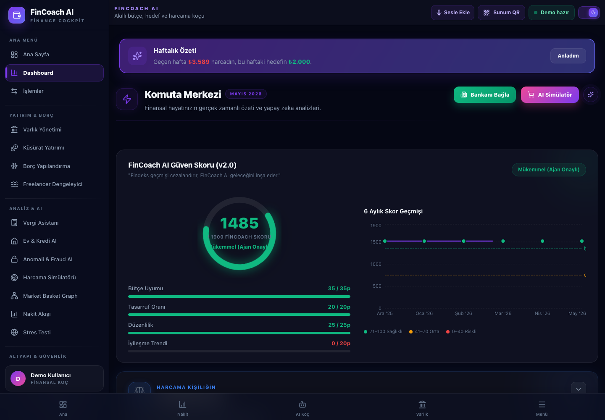
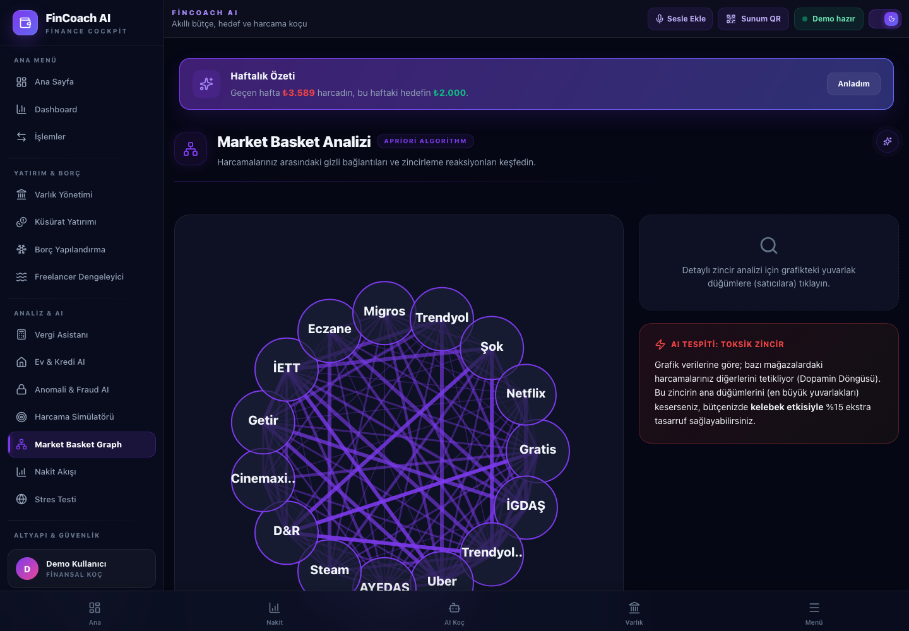
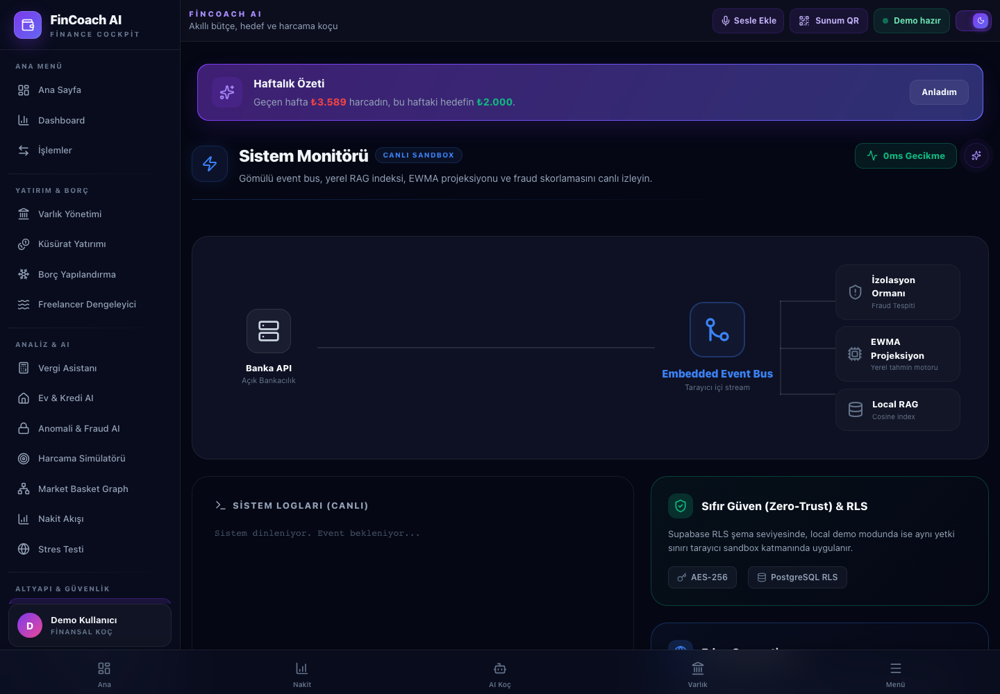
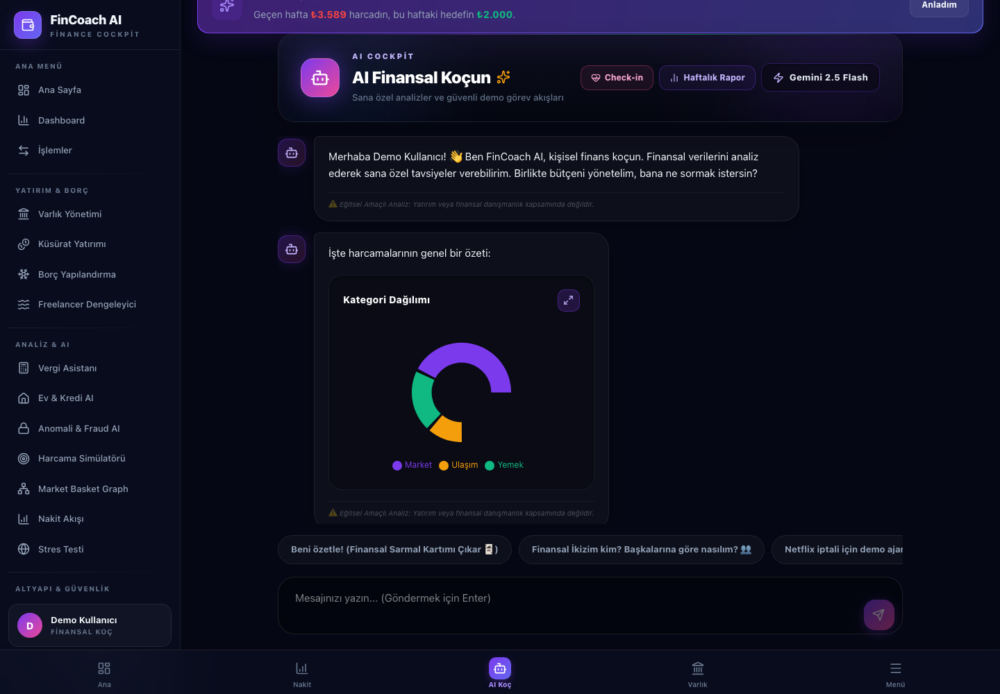
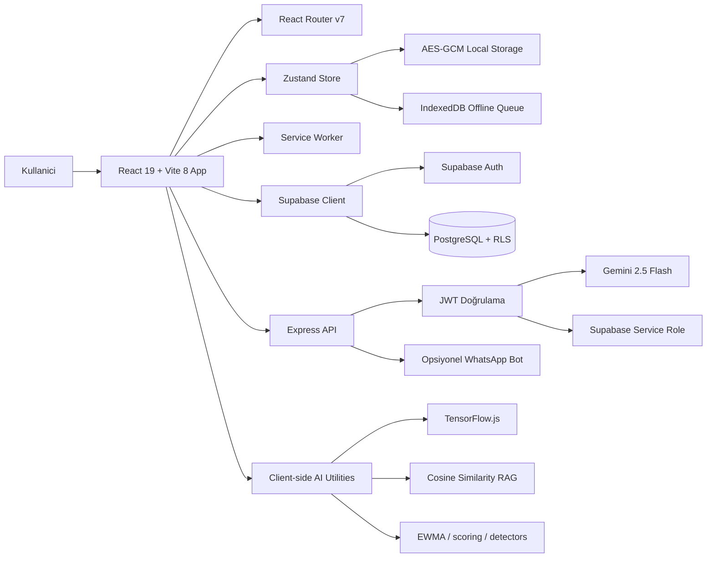
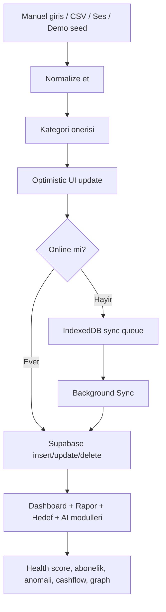
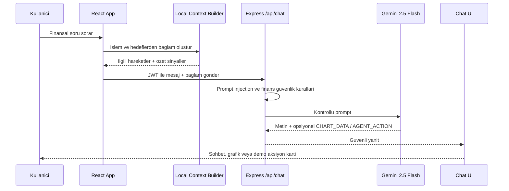
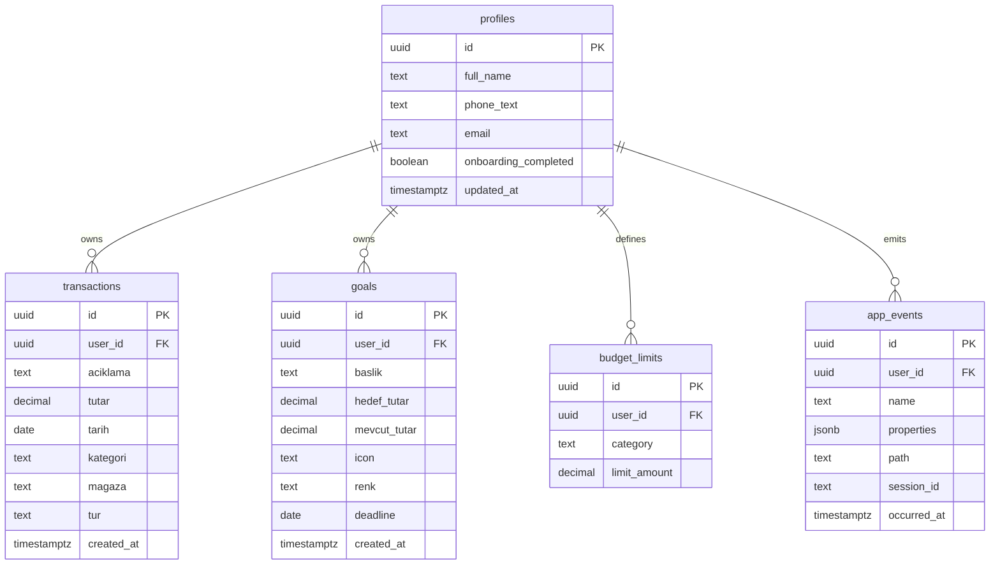
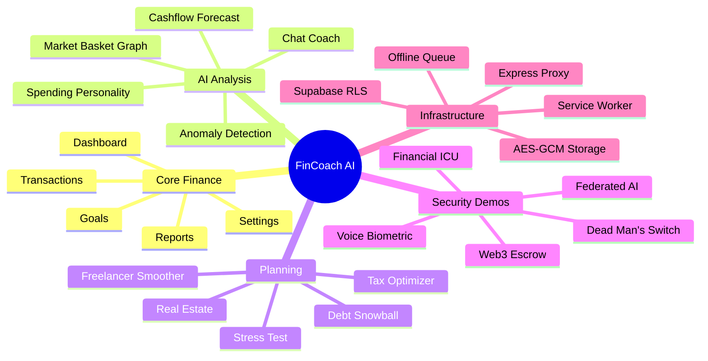

# FinCoach AI

<p align="center">
  <strong>Kişisel finans verisini davranışsal analiz, yapay zeka, offline-first mimari ve güvenli demo ajanlarıyla birleştiren hackathon finans kokpiti.</strong>
</p>

<p align="center">
  
  
  
  
  
  
</p>

<p align="center">
  <a href="#hizli-baslangic">Hızlı Başlangıç</a> •
  <a href="#ekran-goruntuleri">Ekran Görüntüleri</a> •
  <a href="#ozellik-haritasi">Özellik Haritası</a> •
  <a href="#mimari">Mimari</a> •
  <a href="#api">API</a>
</p>

---

<h2 id="proje-ozeti">Proje Özeti</h2>

**FinCoach AI**, klasik gelir-gider takibi yapan bir uygulama degil; kullanicinin finansal durumunu, davranissal risklerini, borc stratejisini, aboneliklerini, hedeflerini ve gelecekteki nakit akislarini ayni komuta merkezinde gosteren bir **AI destekli finansal yasam kocu**.

Hackathon anlatimi icin proje uc soruya cevap verir:

| Soru | FinCoach AI cevabi |
| --- | --- |
| Param nereye gidiyor? | Dashboard, kategori grafikleri, CSV import, Market Basket Graph, abonelik tespiti |
| Kararlarim gelecegimi nasil etkiliyor? | Zaman Makinesi, stres testi, nakit akisi, emlak/kredi analizi, borc kartopu |
| Verim guvende mi? | Supabase RLS, JWT korumali backend proxy, AES-GCM local state, offline sync queue, local demo fallback |

> Web3, escrow, headless-agent, DeFi ve transfer ekranlari hackathon konsept demosudur; gercek banka transferi, blockchain islemi veya abonelik iptali yapmaz. Uygulama bu siniri bilerek ve guvenli sekilde korur.

---

<h2 id="ekran-goruntuleri">Ekran Görüntüleri</h2>

| Finansal kokpit | Market Basket Graph |
| --- | --- |
|  |  |

| Sistem mimarisi | AI finansal koc |
| --- | --- |
|  |  |

---

## One-Liner

> **FinCoach AI**, kullanicinin banka hareketlerini ve hedeflerini gizlilik odakli bir yapay zeka katmaniyla yorumlayip, finansal karar almadan once riskleri, firsatlari ve davranissal tuzaklari gorsellestiren full-stack bir finans platformudur.

---

<h2 id="hizli-baslangic">Hızlı Başlangıç</h2>

### 1. Kurulum

```bash
npm install
```

`npm install` sonrasinda `postinstall` script'i `server` bagimliliklarini da kurar.

### 2. Frontend

```bash
npm run dev
```

Varsayilan adres:

```text
http://localhost:5173
```

Port doluysa Vite otomatik olarak bir sonraki portu kullanir.

### 3. Backend

```bash
cd server
npm start
```

Backend varsayilan adres:

```text
http://localhost:3001
```

### 4. Demo Hesabı

```text
demo@butceai.app
Demo2026!
```

Backend veya Supabase ayarlari yoksa uygulama local demo fallback ile calisir; juri sunumu icin bu mod hizli ve guvenlidir.

---

## Ortam Değişkenleri

Root `.env`:

```env
VITE_SUPABASE_URL=https://proje-id.supabase.co
VITE_SUPABASE_ANON_KEY=public_anon_key
VITE_API_URL=http://localhost:3001
```

`server/.env`:

```env
PORT=3001
HOST=127.0.0.1
GEMINI_API_KEY=gemini_api_key
SUPABASE_URL=https://proje-id.supabase.co
SUPABASE_SERVICE_ROLE_KEY=service_role_key
ALLOWED_ORIGINS=http://localhost:5173,http://127.0.0.1:5173
WHATSAPP_ENABLED=false
```

---

<h2 id="ozellik-haritasi">Özellik Haritası</h2>

### Ana finans deneyimi

| Modül | Rota | Ne işe yarar |
| --- | --- | --- |
| Ana Sayfa | `/` | Uygulama girisi, finansal ozet ve demo yonlendirmesi |
| Dashboard | `/dashboard` | Gelir, gider, tasarruf, hedef ve FinCoach guven skoru |
| Islemler | `/transactions` | Manuel islem, CSV import, sesli ekleme, kategori yonetimi |
| Hedefler | `/goals` | Birikim hedefleri, ilerleme takibi, kesinti simulatoru |
| Raporlar | `/reports` | Detayli analitik, PDF rapor ve aylik karneler |
| Ayarlar | `/settings` | Profil, tema, butce limitleri ve uygulama ayarlari |

### AI ve davranışsal finans

| Modül | Rota | Teknik/ürün değeri |
| --- | --- | --- |
| AI Koc | `/chat` | Gemini destekli finansal sohbet, local fallback, chart/action/card outputlari |
| Harcama Simulatoru | `/shop-sim` | Buyuk satin alim oncesi butce ve duygu etkisi analizi |
| Market Basket Graph | `/graph-analysis` | Harcamalar arasinda 48 saatlik zincir ve tetikleyici baglantilar |
| Anomali & Fraud AI | `/anomaly` | Aykiri harcama ve impulsive spending riskleri |
| Zaman Makinesi | `/time-machine` | Harcama vs yatirim kararinin uzun vadeli etkisi |
| Nakit Akışı | `/cashflow` | Ay içi para erimesi, tahmin ve kritik günler |
| Stres Testi | `/stress-test` | Kriz senaryolari ve dayanma suresi simülasyonu |

### Yatırım, borç ve yaşam kararları

| Modül | Rota | Ne hesaplar |
| --- | --- | --- |
| Varlik Yonetimi | `/wealth` | Net servet, varlik/borc dagilimi, portfoy gorunumu |
| Kusurat Yatirimi | `/micro-invest` | Harcama yuvarlama ve DeFi getirisi konsept demosu |
| Borc Yapilandirma | `/debt-snowball` | Snowball/Avalanche borc odeme stratejileri |
| Freelancer Dengeleyici | `/freelancer-smoother` | Oynak geliri duzenli maas ritmine yaklastirma |
| Vergi Asistani | `/tax` | Giderlestirilebilir kalemler ve PDF rapor |
| Ev & Kredi AI | `/real-estate` | DTI testi, pesinat, kredi ve amortisman analizi |
| Abonelikler | `/subscriptions` | Tekrarlayan odeme tespiti ve iptal onceligi |
| Tasarruf Ligi | `/league` | Oyunlastirilmis tasarruf motivasyonu |

### Altyapı, güvenlik ve hackathon show-case

| Modül | Rota | Sunum etkisi |
| --- | --- | --- |
| Sistem Mimarisi | `/system-monitor` | AI pipeline, veri katmani ve guvenlik topolojisi |
| Federated AI | `/federated` | TensorFlow.js ile cihaz ici egitim ve differential privacy demosu |
| Web3 Escrow | `/escrow` | Sesli kosullu odeme ve Solidity kontrat simülasyonu |
| Self-Driving Money | `/autonomous-agent` | AI ajanlariyla guvenli aksiyon simülasyonu |
| Financial ICU | `/financial-icu` | Iflas radari ve finansal acil durum modu |
| Web3 Vasiyet | `/dead-mans-switch` | Dead man's switch konsept demosu |
| Voice Biometric | `/voice-escrow` | Sesli biyometrik escrow deneyimi |
| Synthetic Data | `/synthetic-data` | Demo veri uretimi ve sandbox senaryolari |

---

## Öne Çıkan Teknikler

| Alan | Implementasyon |
| --- | --- |
| AI backend | Express proxy uzerinden Google Gemini 2.5 Flash, frontend'e API key sizmaz |
| Local RAG | Kullanici islemleri uzerinde cosine similarity tabanli semantik arama |
| Federated learning | `@tensorflow/tfjs` ile cihaz ici model egitimi ve gizlilik odakli agirlik paylasimi demosu |
| Offline-first | IndexedDB sync queue, Service Worker, optimistic update ve rollback |
| Local guvenlik | WebCrypto AES-GCM, non-extractable master key, encrypted Zustand adapter |
| Veri guvenligi | Supabase Auth, PostgreSQL, RLS policy'leri ve JWT kontrollu API |
| Analitik | Recharts, kategori dagilimi, trend, heatmap, graph ve skor panelleri |
| CSV import | PapaParse ile banka ekstresi okuma, format algilama ve tekrar kaydi eleme |
| PDF export | `jsPDF` ile vergi/rapor ciktisi |
| WhatsApp opsiyonel | `whatsapp-web.js` ile mesajdan islem kaydi akisi, kapatilabilir demo modu |

---

## Mimari

### Sistem Topolojisi



### Veri Akışı



### AI Koç Akışı



### Veri Modeli



### Modül Haritası



---

## API

| Method | Endpoint | Amac |
| --- | --- | --- |
| `GET` | `/health` | Backend saglik kontrolu |
| `POST` | `/api/chat` | Gemini destekli AI koc yaniti |
| `POST` | `/api/categorize` | Islemleri kategoriye ayirma |
| `POST` | `/api/ocr` | Fis/gorsel okuma sandbox endpoint'i |
| `POST` | `/api/analyze` | Finansal analiz raporu uretme |
| `POST` | `/api/voice` | Sesli metinden islem alanlari cikarma |
| `POST` | `/api/events` | Urun analitigi / hata izleme olayi |
| `GET` | `/api/whatsapp/status` | WhatsApp bot durumu |

Backend tarafinda CORS whitelist, JSON limitleri, rate limit, scrape host allowlist, JWT dogrulama ve finansal guvenlik prompt politikalari bulunur.

---

## Proje Yapısı

```text
fincoach/
  src/
    components/        UI bilesenleri, dashboard kartlari, modallar
    pages/             Tum rota ekranlari
    store/             Zustand state ve optimistic CRUD aksiyonlari
    utils/             AI, guvenlik, CSV, offline sync, tahmin, kategori araclari
    hooks/             Toast, Supabase data, offline status hooklari
    data/              Demo veri setleri
    config/            Demo hesap ayarlari
  server/
    server.js          Express API, Gemini proxy, guvenlik middlewareleri
    whatsappBot.js     Opsiyonel WhatsApp islem kaydi akisi
    seedDemoAccount.js Demo hesap seed script'i
  public/
    demo-ekstre.csv    CSV import demosu
    sw.js              Service Worker
  docs/images/         README ekran goruntuleri
  supabase_schema.sql  PostgreSQL tablo ve RLS policy'leri
  e2e/                 Playwright smoke testleri
```

---

## Scriptler

| Komut | Aciklama |
| --- | --- |
| `npm run dev` | Vite frontend gelistirme sunucusu |
| `npm run build` | Production build |
| `npm run preview` | Build onizleme |
| `npm run lint` | ESLint kontrolu |
| `npm run test:e2e` | Playwright e2e smoke testleri |
| `npm run seed:demo --prefix server` | Demo hesap seed akisi |
| `npm start` | Build alip Express server ile yayinlama |

---

## Demo Sunum Akışı

1. **Demo hesabi ile giris yap** ve `/dashboard` ekraninda guven skoru, haftalik ozet ve ana metrikleri goster.
2. `/transactions` ekraninda `public/demo-ekstre.csv` dosyasi ile CSV import akisini anlat.
3. `/chat` ekraninda "Bu ay param nereye gitti?" diye sor; grafik/aksiyon ureten AI koc deneyimini goster.
4. `/graph-analysis` ekraninda harcamalar arasindaki tetikleyici iliskileri anlat.
5. `/time-machine` veya `/shop-sim` ile kullanicinin satin alma kararindan once alternatif gelecekleri gordugunu vurgula.
6. `/federated` ve `/system-monitor` ile juriye teknik derinligi ac: local AI, RLS, encryption, offline queue.
7. `/escrow`, `/autonomous-agent`, `/dead-mans-switch` ekranlarini guvenli konsept demo olarak kapat.

---

## Güvenlik Notları

- Gemini API key frontend'e verilmez; backend proxy uzerinden kullanilir.
- Supabase tablolari RLS ile kullanici bazinda izole edilir.
- Local state AES-GCM ile sifrelenir; anahtar IndexedDB'de non-extractable saklanir.
- Offline queue, internet yokken islemleri kaybedecek yerde kuyruga alir.
- AI yanitlari finansal/yatirim/tax kesin talimatlari yerine egitsel ve varsayimlarini belirten guvenli ciktilar uretmeye zorlanir.
- Web3, escrow, headless browser ve abonelik iptali akislarinda gercek para veya gercek servis aksiyonu yapildigi iddia edilmez.

---

## Test ve Doğrulama

```bash
npm run lint
npm run build
npm run test:e2e
```

E2E smoke testleri demo login, ana rotalar ve kritik aksiyon ekranlari uzerinden uygulamanin "guvenli mod" veya auth ekranina dusmeden calistigini kontrol etmek icin tasarlanmistir.

---

## Hackathon İçin Neden Güçlü?

- **Sadece CRUD degil:** AI, davranissal finans, offline sync, RLS, encryption ve simülasyon katmanlari var.
- **Demo riski dusuk:** Backend/Supabase olmadan local fallback ile sahnede calisabilir.
- **Teknik derinlik gorunur:** `/system-monitor` ve `/federated` ekranlari mimariyi juriye direkt anlatir.
- **Kullanici problemi net:** Harcama takibi, abonelik sizintisi, borc stresi, ani satin alma ve finansal belirsizlik tek urunde cozulur.
- **Sunum etkisi yuksek:** Graph, AI chat, zaman makinesi, Web3 escrow ve agent ekranlari hikayeyi guclendirir.

---

## Lisans

Hackathon/demo projesi. Tum haklari saklidir.
